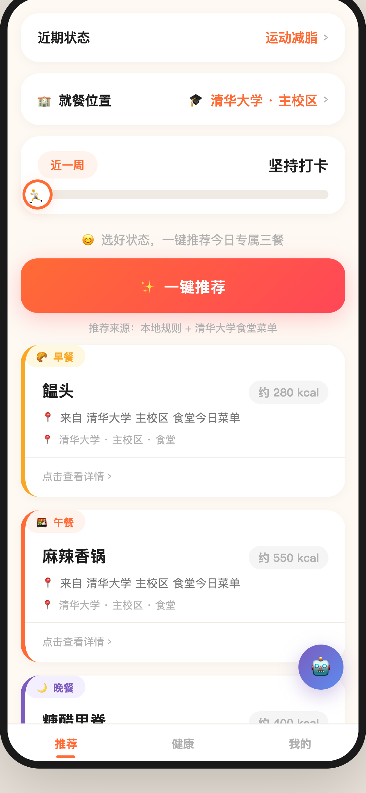
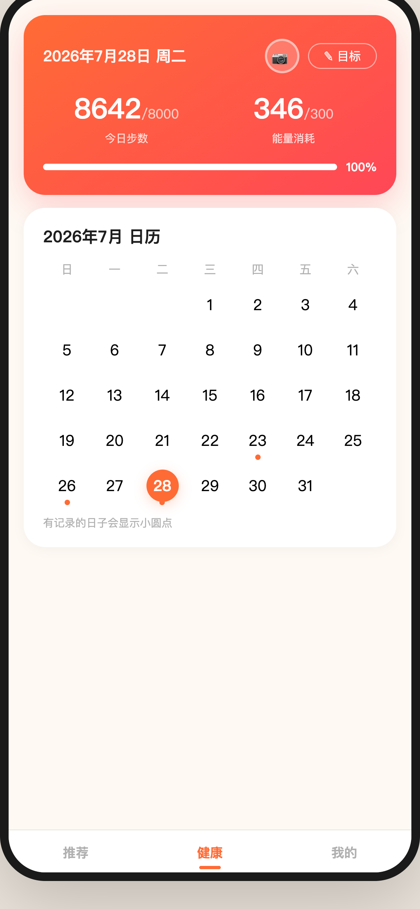
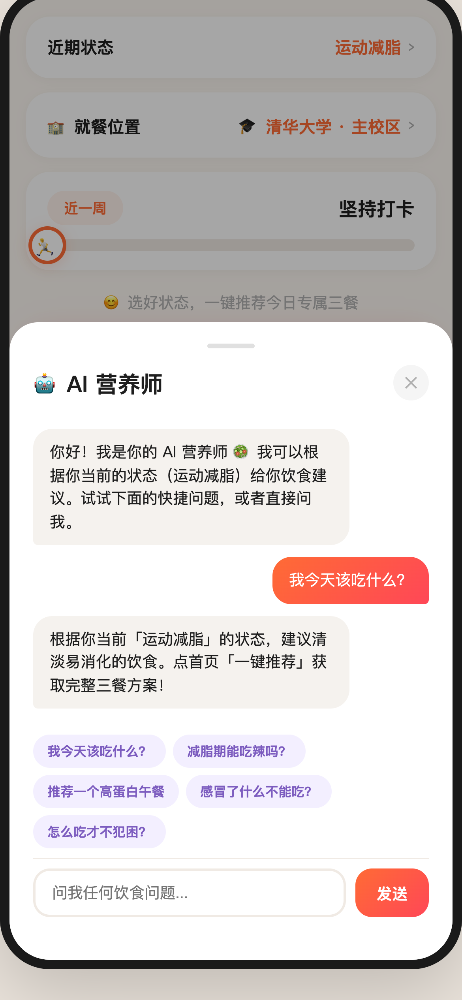

# 食刻 · 智能选餐助手

> 解决「今天吃什么」这个世纪难题——基于身心状态的个性化三餐推荐，覆盖推荐引擎、健康管理、食堂对接、多平台比价的完整产品闭环。

[](https://你的用户名.github.io/shike/)
[](./miniprogram/)
[](#-开发方式vibe-coding)

## 在线体验

- **网页版 Demo**：打开 `index.html` 即可体验（单文件自包含，无需服务器）——**功能最全**，含全部 AI 特性（AI 营养师、NL 偏好识别、多平台比价、推荐解释面板）
- **微信小程序**：`miniprogram/` 目录为完整小程序工程，微信开发者工具导入即可运行——承载核心功能（推荐引擎、AI 营养师对话、NL 偏好识别、推荐解释面板）

> 双端策略：网页版用于快速迭代验证新特性，小程序工程用于生产环境。推荐引擎、NL 解析（`utils/nlParser.js`）、AI 规则引擎（`utils/aiNutritionist.js`）在两端共享同一套算法逻辑。算法细节见 [docs/algorithm.md](./docs/algorithm.md)。

## 产品截图

| 推荐页 | 健康页 | AI 营养师 |
|--------|--------|-----------|
|  |  |  |

（截图占位——实际使用时替换为真实截图）

## 核心功能

### 1. 状态驱动的个性化推荐引擎
不是随机抽菜，而是一套**可解释的加权打分模型**：

```
用户状态（8种身心状态）
    ↓
热量区间约束（如减脂期 480-650 kcal/餐）
    ↓
忌口过滤（辣/油腻/生冷/自定义食材）
    ↓
偏好加权（菜系/主食/水果偏好）
    ↓
营养规则（高蛋白/低GI/温热软烂）
    ↓
三餐差异化输出（早清淡/午均衡/晚轻食）
```

每一道推荐菜都附带**推荐理由**和**打分链路解释**（为什么推荐这道菜），用户能看见 AI 的决策过程。

### 2. AI 营养师对话
内置意图识别规则引擎，支持上下文感知问答：
- 「我今天该吃什么？」→ 结合当前状态 + 忌口 + 偏好生成建议
- 「减脂期能吃辣吗？」→ 状态规则匹配 + 个性化判断
- 「感冒了什么不能吃？」→ 场景化饮食指导

设计上预留了 LLM 接口位，可平滑替换为真实大模型 API（见 `aiAnswer` 函数的规则引擎架构）。

### 3. 全国高校食堂对接
- 收录 **1969 所高校、2144 个校区**（数据来源：CollegesChat 开源项目）
- 搜索式学校选择器 + 校区二级选择
- 食堂菜单与推荐引擎融合：推荐结果自动混入所选食堂的当日菜单

### 4. 多平台比价
周边餐厅卡片化展示，同一家店在**美团/饿了么/盒马/叮咚/大众点评**的预估价和配送时间对比，最低价高亮，点击 deep link 直达对应 App（带 H5 回退）。

### 5. 健康打卡系统
- 步数/体重/餐食照片日历记录
- 左右滑动切换日期的浮窗交互
- 日期范围统计：打卡坚持率可视化

## 技术架构

```
┌─────────────────────────────────────────┐
│  表现层   微信小程序 WXML/WXSS + 单文件HTML │
├─────────────────────────────────────────┤
│  逻辑层   推荐引擎（打分模型）              │
│           AI 规则引擎（意图识别）           │
│           本地存储（localStorage/wx.Storage）│
├─────────────────────────────────────────┤
│  数据层   112 道内置菜谱（6菜系×8状态）      │
│           1969 所高校校区库               │
│           菜单模板池（按地区差异化）         │
├─────────────────────────────────────────┤
│  云端     云函数：AI 推荐 / 语音转文字       │
│           （预留：美团/淘宝 OpenAPI 代理层） │
└─────────────────────────────────────────┘
```

## 开发方式：Vibe Coding

本项目全程采用 **Vibe Coding** 模式开发——用自然语言描述需求，与 AI 协作迭代 30+ 轮完成：

1. **需求定义**：PRD 先行（见 `docs/PRD.md`）
2. **AI 生成 + 人工架构决策**：推荐引擎打分模型、数据结构设计由人工定义，代码由 AI 生成
3. **高频迭代**：UI 视觉、交互细节、数据校验逐轮打磨
4. **双端同步**：小程序工程与单文件预览版保持功能一致

这套工作流让独立开发者在 2 周内完成了传统团队 1-2 个月的产品原型。

## 项目结构

```
shike/
├── index.html              # 单文件网页版（GitHub Pages 托管）
├── miniprogram/            # 微信小程序完整工程
│   ├── pages/              # 推荐/健康/我的 三个页面
│   ├── utils/              # 推荐引擎/菜谱库/食堂数据/存储
│   └── cloudfunctions/     # AI 推荐、语音转文字云函数
├── docs/
│   └── PRD.md              # 产品需求文档
└── screenshots/            # 产品截图
```

## 后续规划

- [ ] 接入真实 LLM API（混元/GPT）替换规则引擎
- [ ] 美团/淘宝 OpenAPI 代理层（云函数签名转发）
- [ ] 用户行为分析看板（状态分布/推荐采纳率）
- [ ] 语音输入偏好解析（ASR + NER 提取忌口关键词）

## License

MIT
